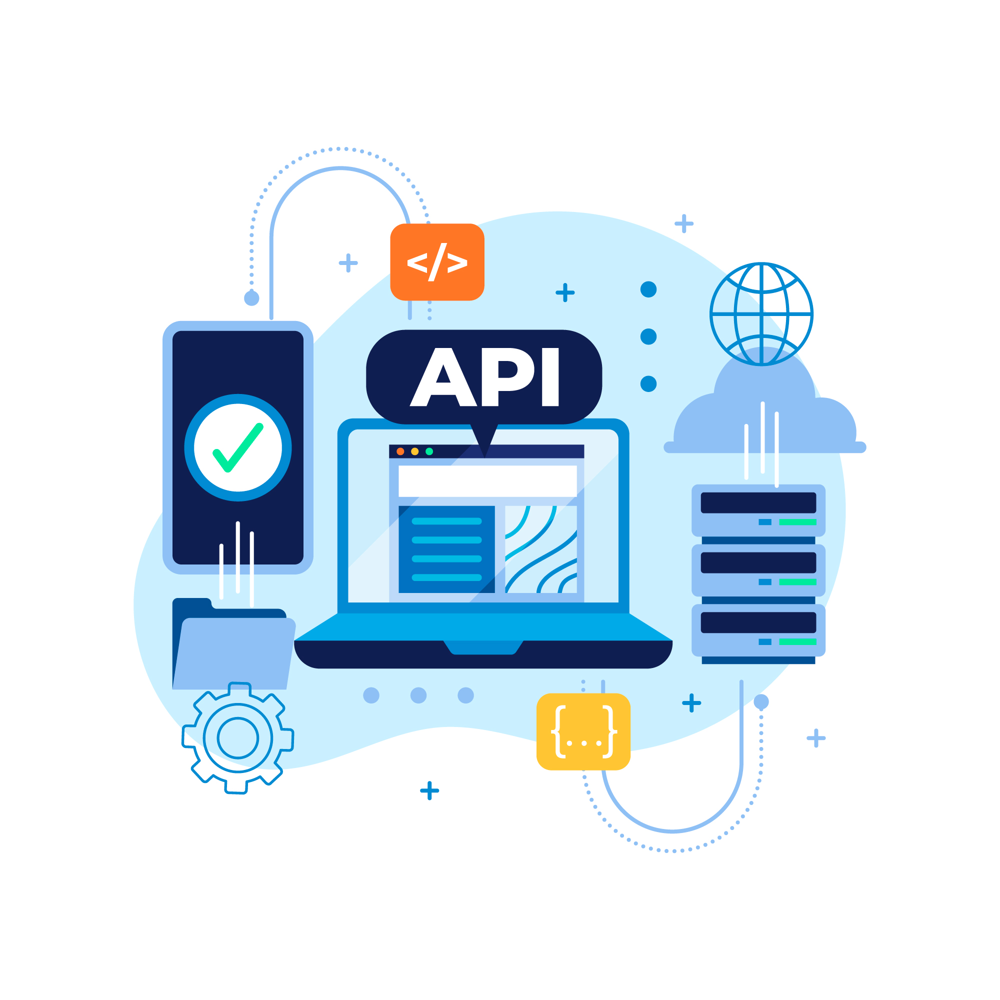

A JobsApi é uma api rest desenvolvida para divulgação de oportunidades de emprego em qualquer área de atuação.

## 📋 Documentação da Api

[JobsApi - Swagger](http://localhost:3000/v1/swagger)

[JobsApi - Redocly](http://localhost:3000/v1/redocly)


## 📋 Funcionalidades do Sistema

- [x] Cadastrar Job.
- [x] Listar Jobs.
- [x] Alterar Job.
- [x] Deletar Job.

## 🔨 Tecnologias Utilizadas

 1. NodeJs
 2. Express
 3. Prisma
 4. MongoDb
 5. Swagger
 6. Docker

## 👨‍💻 Como executar o projeto com Docker.

### Passo a passo
Clone Repositório
```sh
git clone git@github.com:FelipeDevFull/JobsApi.git
```
Acesse o Diretório
```sh
cd JobsApi
```
Crie o Arquivo .env
```sh
cp .env.example .env
```
Atualize a variável de ambiente do arquivo ".env" com a string de conexão atlas mongodb.

[Tutorial conexão atlas mongodb](https://youtu.be/anMK76I2dUA?t=892)
```dosini
DATABASE_URL=""
```
Suba os containers do projeto
```sh
docker compose up
```
Acesse o projeto

[http://localhost:3000/v1/jobs](http://localhost:3000/v1/jobs)
